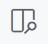

# Writing in Markdown

All of the writing that we will do will be written in Markdown. Markdown is a simple markup language that allows us to give structure to the text that we're writing. Some examples of creating structure in documents include assigning hierarchical headings, identifying words or phrases that are important, creating ordered and unordered lists, and organizing information into tables.

Markdown documents are just plain text files. You can create and edit them using any text editor, including Visual Studio Code. The only requirement is that you follow some simple rules about how the documents are structured and formatted.

## Markdown Rules

The basic rules for writing Markdown can be found in the [Markdown Guide](https://www.markdownguide.org)

As you can see, the special syntax for Markdown files does not make the text any less readable. Although it's easily understood by a human, the syntax also provides all the information needed for software applications to render the document into other formats, like PDFs or web pages.

By using Markdown syntax, you are making the structure of the document clear. Using Markdown means that you can spend more time focusing on the text you are writing and less time fussing with pagination, fonts, and other formatting details. It's simple, works on any computer, and is used in lots of different applications and services.

## Markdown and GitHub

Markdown is sort of the official language of GitHub. Markdown files are automatically rendered in the browser when they are opened on the GitHub website. In addition to the normal Markdown rules, GitHub has added a few extra features of its own. They call this [GitHub Flavored Markdown](https://docs.github.com/en/get-started/writing-on-github/getting-started-with-writing-and-formatting-on-github/basic-writing-and-formatting-syntax).

## Markdown and VS Code

When a file is saved with the .md extension, it's identified as a Markdown document. VS Code knows Markdown and gives us some handy syntax highlighting/coloring in the editor. Clicking the **Open Preview** button in the upper right of the editor window opens a rendered view of the Markdown document that is updated live while you edit.

|  |
|:--:|
| *Open Preview button* |

The **Markdown All in One** extension that you installed earlier adds some Markdown-specific features that are handy. For example, if you copy a URL to the clipboard and paste it on top of some text in VS Code, it will create a Markdown-formatted link. There are lots of other helpers that this extension provides, but a very common one is auto completions. Try typing the word `image` in a Markdown document, followed by Return, to automatically generate the syntax for inserting an image into your document. (Better still, you can drag an image directly onto the editor!)

The **markdownlink** extension continuously checks your document to ensure that you are following the Markdown rules. Errors and warnings appear with red and yellow underlines, respectively. Hovering over an issue provides more context and suggestions for solving the problem. These issues can also be seen in the file explorer sidebar (as a color-coded number of issues) and as colored bars in the document map on the right side of the editor. Note that other extensions, like the Grammarly extension, also identify errors and warnings in the same way. Striving to always have documents that are free of errors is a good practice, especially when writing with others.

Another very handy extension to install is **Markdown PDF**, which renders Markdown documents into PDFs.

## Try It

1. In VS Code, choose **File > New Text File**
2. Click **Select Language** and choose Markdown. If you skip this step, you can let VS Code know that you are writing Markdown by saving the file right away with a `.md` extension at the end of its name. Alternatively, you can click "Plain Text" on the bottom status bar to switch to the Markdown language mode.
3. Begin your document by including a top-level heading. (Look at the [Markdown Cheat Sheet](https://www.markdownguide.org/cheat-sheet/) for help)
4. Add a paragraph that includes some bold text and a link to your favorite website. (Maybe try  [a different Markdown Cheatsheet](https://github.com/adam-p/markdown-here/wiki/Markdown-Cheatsheet) for help this time)
5. Finally, add an ordered grocery list.

Does your document have any errors or warnings? Are they related to markdown syntax or spelling/grammar? Fix all of the issues before saving your file with `.md` at the end of its name.
